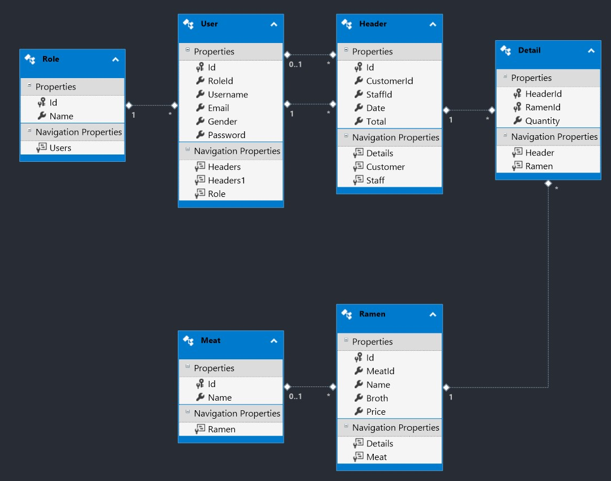

# Raamen - Final Project Pattern Software Design

## Important Notes To Run the Project

1. Rebuild the whole Project / Solution
2. Restore the Client-side Libraries (Right click at libman.json)
3. Run the project!

## Entity-Relationship Diagram

Overall, the ERD is the same from ERD that given from the case. Added one column (Total) in Header table for total Price in one transaction  
